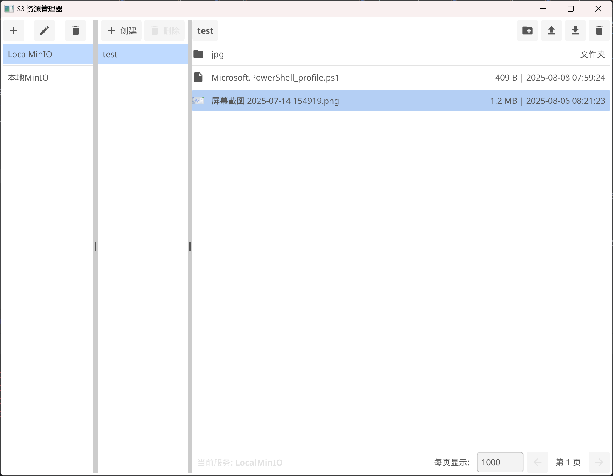

# S3 Explorer

## 简介

S3 Explorer 是一个基于 Go 语言和 Fyne UI 框架开发的桌面应用程序，旨在提供一个直观易用的界面，帮助用户管理 S3 兼容存储服务（如 Amazon S3、MinIO 等）中的存储桶和对象。

## 主要功能

*   **多服务管理**: 支持配置和连接多个 S3 兼容存储服务。
*   **存储桶操作**: 轻松列出、创建和删除存储桶。
*   **对象浏览**: 浏览存储桶中的文件和文件夹，支持分页加载以优化性能。
*   **文件操作**: 上传、下载和删除文件及文件夹。
*   **文件预览**: 支持在应用内预览常见图片格式（PNG, JPG, GIF）和文本文件。
*   **面包屑导航**: 提供清晰的路径导航，方便用户在不同层级间切换。

## 技术栈

*   **后端**: Go 语言
*   **UI 框架**: Fyne (fyne.io)
*   **S3 交互**: AWS SDK for Go v2

## 安装

### 环境要求

*   Go 1.20 或更高版本
*   Fyne 依赖 (通常在运行 `go mod tidy` 时会自动处理)

### 构建与运行

本项目提供了一个 `Makefile` 来简化多平台应用的构建过程。

#### 环境要求

*   **Go**: 版本 1.20 或更高。
*   **Make**: 在 macOS 和 Linux 上通常已预装。Windows 用户需要自行安装 (例如通过 [Chocolatey](https://chocolatey.org/install) 执行 `choco install make`) 或使用一个类 Unix 环境 (如 Git Bash 或 WSL)。

#### 编译

在项目根目录下，您可以运行以下命令：

- **为当前系统构建**:
  ```shell
  make build
  ```

- **为指定平台交叉编译**:
  ```shell
  make build-windows  # 构建 Windows 版本
  make build-linux    # 构建 Linux 版本
  make build-macos    # 构建 macOS 版本
  ```
  *注意：在 Windows 上构建时，`Makefile` 会自动添加 `-ldflags="-H windowsgui"` 标志，以确保生成的是一个没有控制台后端的 GUI 应用。*

- **一键构建所有平台**:
  ```shell
  make all
  ```

- **清理构建产物**:
  ```shell
  make clean
  ```

所有生成的可执行文件都会被存放在项目根目录下的 `build` 文件夹中。

#### 运行

1.  **开发时运行**:
    ```shell
    go run .
    ```
2.  **运行构建好的程序**:
    直接在 `build` 文件夹中找到对应您系统的可执行文件并运行。

## 使用方法

1.  **启动应用**: 运行 `go run .` 或双击构建好的可执行文件。
2.  **添加 S3 服务**:
    *   在左侧面板，点击“添加服务”按钮。
    *   填写服务别名、Endpoint、Access Key 和 Secret Key。
    *   点击“添加”保存配置。
3.  **选择服务**: 在左侧服务列表中选择您添加的服务。
4.  **浏览存储桶**: 中间面板将显示该服务下的所有存储桶。点击存储桶名称即可进入。
5.  **管理对象**: 右侧面板将显示存储桶中的文件和文件夹。
    *   **创建文件夹**: 点击“创建文件夹”按钮。
    *   **上传文件/文件夹**: 点击“上传”按钮，选择上传文件或上传文件夹。
    *   **下载**: 选中一个或多个文件/文件夹，点击“下载”按钮，选择保存路径。
    *   **删除**: 选中一个或多个文件/文件夹，点击“删除”按钮进行删除。
    *   **预览**: 双击图片或文本文件进行应用内预览。

## 运行截图 


